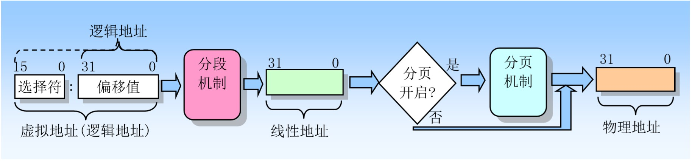
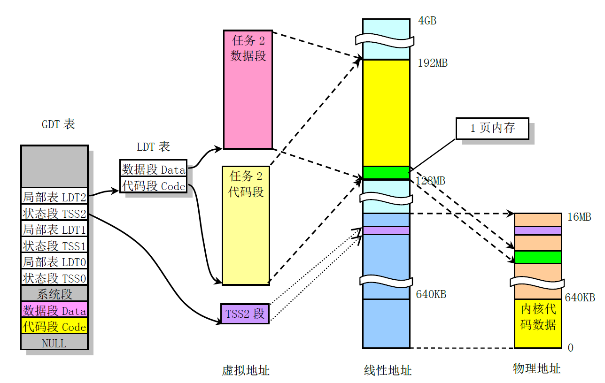
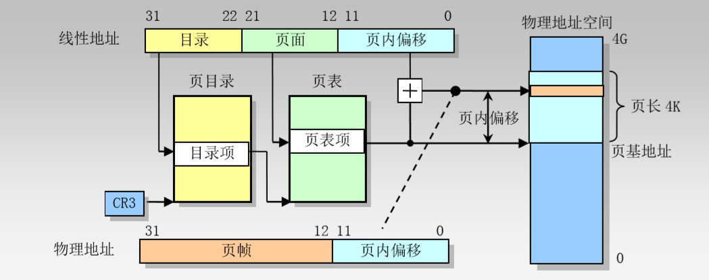

linux-0.12内存管理的基本概念。

<!--more-->

## 内存地址映射时的三种地址

Linux0.12内核中， 在进行内存的地址映射操作时有3种地址：

- **虚拟地址**（Virtual Address）是指由程序产生的由**段选择符**和**段内偏移地址**两个部分组成的地址，这里的段内偏移也被称为**逻辑地址**。用于程序内部寻址。

- **线性地址**（Linear Address）是指段选择符所指向的段描述符中的**段基址值**加上**段内偏移**计算得出的地址。

- **物理地址**（Physical Address）是最终寻址物理内存的地址，是地址变换的最终结果地址。

    - 启用了分页机制，那么线性地址会使用**页目录和页表中的项**变换成物理地址。
    - 没有启用分页机制，那么线性地址就是物理地址。

虚拟地址到物理地址的变换过程如下图所示：

## 分段机制（虚拟地址到线性地址的转换）

### CPU在实模式和保护模式下寻址方式的不同

- 在实模式下，寻址一个内存地址主要是使用段寄存器和段内偏移值就足够了，段寄存器中直接存放段基值，且段的长度被固定为64KB。

- 而在保护模式下，则额外需要一张**段描述符表（Segment Descriptor Table）**。段寄存器中存放的是**段选择符**（是一个段描述符表中某一描述符项在表中的索引值）。该索引值指定的**段描述符**项中含有需要寻址的内存段的**基地址**、段的长度值和段的访问特权级别等信息。

    

### 保护模式下用到的三种描述符表

- **全局描述符表**（GDT Global Descriptor Table）是主要的基本描述符表，该表可被所有程序用于引用访问一个内存段。

- **中断描述符表**（IDT Interrupt Descriptor Table）保存有定义中断或异常处理过程的段描述符。 IDT表直接替代了8086系统中的中断向量表。

- **局部描述符表**（LDT Local Descriptor Table）应用于多任务系统中，通常每个任务使用一个LDT表。作为对GDT表的扩充，每个LDT表为对应任务提供了更多的可用描述符项，因而也为每个任务提供了可寻址内存空间的范围。这些表可以保存在线性地址空间的任何地方。

在Linux0.12系统中，一个任务的代码段和数据段的段限长相同，并被映射到线性地址完全相同而重叠的区域上。以任务2为例，虚拟地址、线性地址和物理地址之间的关系如下图

### 段选择符和段描述符

**段选择符**（或称段选择子）是段的一个16位标识符，保护模式下段寄存器中的值。

段选择符的3个字段内容：

- 请求特权级RPL（Requested Privilege Level）提供段保护信息

- 表指示标志TI （Table Index）

    - TI = 0 描述符在GDT中
    - TI = 1 描述符在LDT中

- 索引值（ Index ）

**段描述符**是GDT和LDT表中的一个数据结构项，用于向处理器提供有关一个段的位置和大小信息以及访问控制的状态信息。每个段描述符长度是8字节，含有三个主要字段：段基地址、段限长和段属性。

## 分页机制（线性地址到物理地址的映射）

分段机制把虚拟地址转换成线性地址，而分页则把线性地址转换成物理地址。

我们通过设置**控制寄存器CR0的PG位**可以启用分页机制。如果PG=1，则启用分页操作。当使用分页时，处理器会把线性地址空间划分成固定大小的页面（长度为4KB），这些页面可以映射物理内存中或磁盘存储空间中（这种方式被称为**虚拟存储**或者**需求页（Demand-paged）虚拟存储**）。

### 进程空间映射到线性地址空间

在linux0.12中，每个进程能够使用64M内存，并且每个进程的逻辑地址空间在线性地址空间中都是从nr*64MB 的地址位置开始（nr 是任务号）。其中，最后部的环境参数数据块最长为128K，其左面是起始堆栈指针。另外，图中bss是进程未初始化的数据段，在进程创建时bss段的第一页会被初始化为全零。

请还需注意，进程逻辑地址空间中代码段（ Code Section ）和数据段（ Data Section ）的概念与CPU分段机制中的代码段和数据段不是同一个概念。

- CPU分段机制中段的概念确定了在线性地址空间中一个段的用途以及被执行或访问的约束和限制，每个段可以设置在4GB线性地址空间中的任何地方，它们可以相互独立也可以完全重叠或部分重叠。

- 进程在其逻辑地址空间中的代码段和数据段则是指由编译器在编译程序和操作系统在加载程序时规定的在进程逻辑空间中顺序排列的代码区域、初始化和未初始化的数据区域以及堆栈区域。

### 线性地址映射到物理地址

linux0.12采用了两级页表结构。第一级表称为**页目录表（page directory）**，第二级表称为**页表（page table）**。

由**CR3寄存器**指定页目录表的基地址，线性地址的高10位用于索引页目录表，以获取页表所在位置；线性地址中间 10 位用于索引二级页表，以获得物理地址的高 20 位；线性地址的低12位直接作为物理地址低12位（页内偏移）；从而组成一个完整的32位物理地址。

### 页目录表项和页表项结构

页目录项和页表项（4字节）的结构为

- **P** - 位0是存在（Present）标志，用于指明表项对地址转换是否有效。P=1 表示有效；P=0 表示无效。 在页转换过程中，如果说涉及的页目录或页表的表项无效，则会导致一个异常。如果 P=0，那么除表示表项无效外，linux-0.12可以使用其他位来保存在交换空间的页面号。 所以根据表项内容可以判断：

    1. **表项为0** - 该表项无效；
    2. **P = 1** - 该项指向的页面在物理内存中；
    3. **P = 0，但表项不为0** - 该项指向的页面在交换空间中。

- **R/W - 位1**是读/写（Read/Write）标志。如果等于 1，表示页面可以被读、写或执行。如果为 0，表 示页面只读或可执行。**当处理器运行在超级用户特权级（级别 0、1 或 2）时，则 R/W 位不起作用。**

- **U/S** - 位2是用户/超级用户（User/Supervisor）标志。如果为 1，那么运行在任何特权级上的程序都可以访问该页面。如果为 0，那么页面只能被运行在超级用户特权级（0、1 或 2）上的程序访问。

- **A** - 位5是已访问（Accessed）标志。当处理器访问页表项映射的页面时，页表表项的这个标志就会 被置为 1。当处理器访问页目录表项映射的任何页面时，页目录表项的这个标志就会被置为 1。处理器只负责设置该标志，操作系统可通过定期地复位该标志来统计页面的使用情况。

- **D** - 位6是页面已被修改（Dirty）标志。当处理器对一个页面执行写操作时，就会设置对应页表表项 的 D 标志。处理器并不会修改页目录项中的D标志。

- **AVL** - 该字段保留专供程序使用。处理器不会修改这几位，以后的升级处理器也不会。
