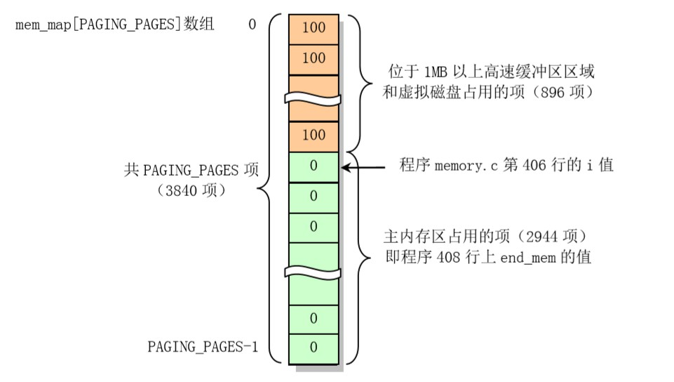

linux0.12内存管理中，分页机制的实现。

<!--more-->

## 分页机制下对物理内存和交换空间的管理

### 一、物理内存的管理

- 相关文件：`mm/memory.c`

对于linux0.12内核，它默认**最多支持16M物理内存**。在一个具有16MB内存的80x86计算机系统中，物理内存从低到高分别为

对于内核代码和数据所占物理内存区域以外的内存（**1MB以上内存区域**），内核使用了一个字节数组`mem_map[]`来管理物理内存页面（一页为4KB）的状态。每个字节描述一个物理内存页的占用状态。其中的值表示被占用的次数，0表示对应的物理内存空闲着。当申请一页物理内存时，就将对应字节的值增1。当值为100时，表示已被完全占用，不能再被分配。

- **初始化**：`mem_init`会初始化`mem_map[]`，系统首先把`mem_map[]`所有项都置为100（占用），然后把**主内存区域**对应的`mem_map[]`项中的值清0。

- **申请物理内存**：`get_free_page`会在`mem_map[]`从尾到头的查找值为0的项返回，如果没找到空闲页面，则会执行`swap_out`换出操作。

- **释放物理内存**：`free_page`用于释放物理内存的1页内存；若页面在交换设备中，则用`swap_free`释放。

### 二、交换空间的管理

- 相关文件：`mm/swap.c`

从0.12版本开始，内核中增加了虚拟内存交换功能。在物理内存容量有限并且使用紧张时，本程序会将暂时不用的内存页面内容临时输出保存到交换设备上，以腾出内存空间给急需的程序使用。若此后要再次使用到已保存到磁盘上的内存页面内容，这本程序再负责将它们换回到内存中去。

内存交换管理使用了与主内存区管理相同的位图映射技术，使用**比特位图**来确定被交换的内存页面具体的保存位置和映射位置。初始化完成后，交换页面位图会占用一个物理页面，由于一个页面共有`SWAP _BITS`（4096*8）个比特位，因此交换分区可管理页面数最多不超过32768 个页面，即**最多换出不超过128MB物理内存（实际，以交换分区大小swap_size为准）**。

- **初始化**：`init_swapping`会初始化一个交换页面位图`swap_bitmap`（该位图存在一页物理内存页面中），在交换页面位图中，`swap_bitmap[1 ~ swap_size-1]`可用。比特位值为`1`表示交换页面空闲可用，`0`表示不可用。

- **换出到交换设备**：`swap_out`用于将一页物理内存页面换出到交换空间。该函数会调用`try_to_swap_out`函数对从`FIRST_VM_PAGE`起每一页物理内存尝试换出，直到换出一页为止，换出规则为：
    1. 当前页面未被修改，则直接释放该页面即可。毕竟重新从文件读入和从交换空间换入效率相差不大。
    2. 当前页面被修改过，则尝试换出（若该页面又是被共享的，不宜换出）。

- **换入到物理内存**：`swap_in`用于把指定页面交换进物理内存中。

- **释放**：`swap_free`用于释放交换设备中指定的交换页面。
