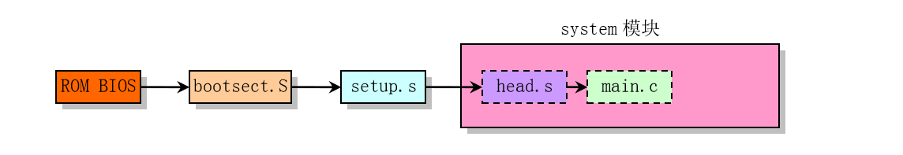
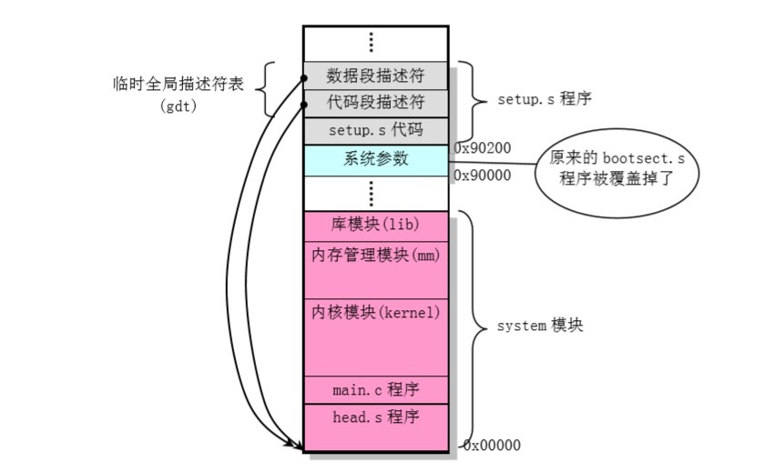

从PC上电到进入系统初始化main函数的过程中，内核做了哪些事情？

<!--more-->

- 相关文件：`boot/*`

其中，`bootsect.S`和`setup.S`是**实模式**下运行的16位代码程序，采用近似于Intel的汇编语言语法，并且需要使用8086汇编编译器as86和链接器ld86。 `head.s`则使用一种AT&T的汇编语法格式，并且运行在保护模式下，需要用GNU的as（gas）汇编器进行编译。

## 内核映像在磁盘中的格式

## CPU执行权的移交

CPU执行权的移交如下图所示：

当PC的电源打开后，80x86结构的CPU将自动进入实模式，并从地址`0xFFFF0`开始自动执行程序代码，这个地址通常是ROM BIOS中的地址。PC机的BIOS将执行系统的某些硬件检测和诊断功能，并在物理地址0处开始设置和初始化中断向量。此后，它将可启动设备的第一个扇区（磁盘引导扇区，512字节，也就是`bootsect`）读入内存绝对地址`0x7C00`处，并跳转到这个地方开始引导启动机器运行了。

# 内核在内存中的移动情况

1. `BIOS`将引导设备的第一个扇区（`bootsect`）读入到内存绝对地址**0x7C00**处；
2. `bootsect`执行时将自己移动到内存绝对地址**0x90000**处；
3. `bootsect`之后会将紧接着的4个扇区代码（`setup`）读入到内存**0x90200**处；再将之后的`system`模块读入到内存**0x10000**处（当时system不会超过0x80000字节，不会覆盖**0x90000**处开始的`bootsect`和`setup`）；
4. `bootsect`最后跳转到`setup`中执行；
5. `setup`又会把`system`移动到物理内存起始处**0x00000**；

# bootsect、setup、head各自干了啥

## bootsect

bootsect把整个内核映像加载到了内存是它最大的贡献了（PS：只有它保存在0x901FC处的`ROOT_DEV`和0x901FA处的`SWAP_DEV`还被记得）。

1. 将自己从0x7c00移动到0x90000处；
2. 为了更快地加载内核，修改了软驱参数表；
3. 加载`setup`模块到0x90000处；
4. 加载`system`模块到0x10000处
5. 干完活，跳转去`setup`。

## setup

setup主要做了三件事：获取系统的一些参数，移动system模块，开启保护模式。

1. 获取系统初始化所需要的参数；

    

2. 把整个system模块移动到0x00000位置；
3. 因为要开启保护模式，所以设置了一个临时的gdt表和ldt表；
4. 将控制寄存器CR0位0置1，从而开启保护模式；
5. 跳转到`head`中执行。

setup结束后，内存中的程序示意图如下所示

## head

`head`很大一部分代码都是**一次性的**；用完就被页目录表和页表覆盖掉了。`head`主要为之后操作系统的运行留下了几件重要的东西：1个页目录表和4个内核专属的页表，中断描述符表IDT和全局段描述符表GDT，以及一个哑中断`ignore_int`。

1. 将系统堆栈放置在`stack_start`指向的数据区（之后，该栈就被用作任务0和任务1共同使用的用户栈）；
2. 重新加载了新的中断描述符表IDT和全局段描述符表GDT；
3. 检查数学协处理器芯片是否存在；
4. 初始化页目录表和4个内核专属的页表；
    1. **页目录表（4KB）从物理地址0处开始，紧接着4个内核专属的页表（4*4KB）**；
5. 通过`ret`跳转到`init/main.c`中的`main`运行。
