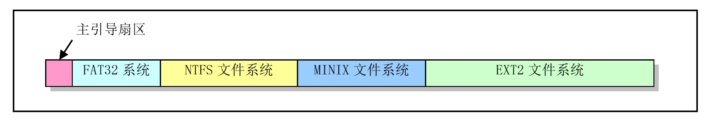
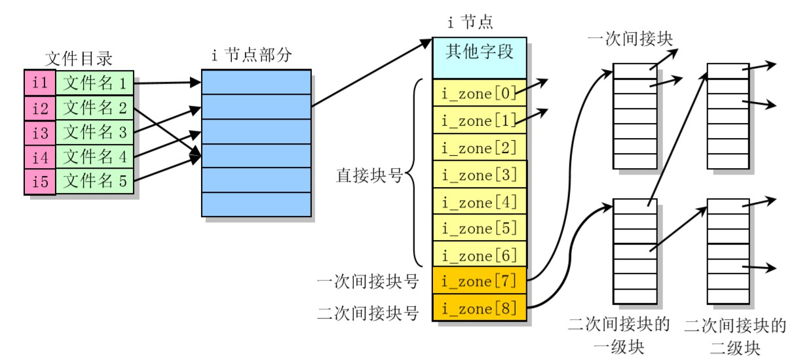

MINIX文件系统的介绍，以及文件系统中重要的数据结构 - i节点。

<!--more-->

## MINIX文件系统总览

在实现linux0.12文件系统时，Linus主要参考了《MINIX操作系统设计和实现》，使用了1.0版的MINIX文件系统（其主要结构定义在`include\linux\fs.h`）。

MINIX文件系统与标准UNIX的文件系统基本相同，它由6个部分组成：引导块、超级块、i节点位图、逻辑块位图、i节点、数据块。首先，一个磁盘被划分成以1KB为的单位的磁盘块。


- **引导块**，存放BIOS自动读入的执行代码和数据，用于加载内核（即linux0.12中的bootsect）

- **超级块**，用于存放盘设备上文件系统结构的结构信息，它决定了其他结构占用磁盘的大小和文件系统的一些属性

- **i节点位图**，1比特位代表1个i节点的使用情况

- **逻辑块位图**，1比特位代表1个磁盘块的使用情况

- 之后若干磁盘块存放文件的**i节点**结构，每个i节点存放有1个文件或目录的索引信息（文件长度，数据块在磁盘上的位置等）

- 最后是**文件数据区**，用于存放文件数据

### 引导块

引导块是开机时由BIOS自动读入的执行代码和数据的盘块。但一个系统中并非所有盘设备都用作引导设备，对于非引导盘，仍然需要空出引导块的位置，这一盘块中可以不含任何内容。

另外，有些硬盘会被划分出几个分区，并且在每个分区中都可存放一个不同的文件系统。例如，下图中的硬盘划分成了4个分区，分别存放着FAT32、NTFS、MINIX和EXT2文件系统。硬盘的第一个扇区是主引导扇区，其中存放着硬盘引导程序和分区表信息。分区表中的信息指明了硬盘上每个分区的类型、在硬盘中起始位置参数和结束位置参数以及占用的扇区总数。



### 超级块

超级块用于存放盘设备上文件系统的结构信息，并说明各部分的大小。

```c
struct super_block {
	unsigned short s_ninodes;			/* 节点数 */
	unsigned short s_nzones;			/* 逻辑块数 */
	unsigned short s_imap_blocks;		/* i节点位图所占用的数据块数 */
	unsigned short s_zmap_blocks;		/* 逻辑块位图所占用的数据块数 */
	unsigned short s_firstdatazone;		/* 第一个数据逻辑块号 */
	unsigned short s_log_zone_size;		/* Log2(数据块数/逻辑块) */
	unsigned long s_max_size;			/* 文件最大长度 */
	unsigned short s_magic;				/* 文件系统魔数 */
	/* 以下是内存中特有的 */
	struct buffer_head * s_imap[8];		/* i节点位图缓冲块指针数组(占用8块) */
	struct buffer_head * s_zmap[8];		/* 逻辑块位图缓冲块指针数组(占用8块) */
	unsigned short s_dev;				/* 超级块所在设备号 */
	struct m_inode * s_isup;			/* 被安装的文件系统根目录的i节点(isup-superi) */
	struct m_inode * s_imount;			/* 被安装到的i节点 */
	unsigned long s_time;				/* 修改时间 */
	struct task_struct * s_wait;		/* 等待该超级块的进程 */
	unsigned char s_lock;				/* 被锁定标志 */
	unsigned char s_rd_only;			/* 只读标志 */
	unsigned char s_dirt;				/* 已修改(脏)标志 */
};
```

在Linux0.12系统中，被加载的文件系统超级块保存在`super_block[]`数组中（共有8项，因此最多同时加载8个文件系统）。在内核初始化过程中，进程1（init进程）会执行系统调用`setup`，从而调用`mount_root()`，会初始化超级块表，同时安装根文件系统。

`read_super`函数会为新加载的文件系统在表中设置一个超级块项，`put_super`函数中释放超级块表中指定的超级块项。

### i节点位图

i节点用于存放盘设备上每个文件和目录名的索引信息。i节点位图用于说明i节点是否被使用，同样是每个比特位代表一个i节点。当所有i节点都被使用时，查找空闲i节点的函数会返回0值，因此i节点位图的比特位0和对应的i节点0都闲置不用。

### 逻辑块位图

逻辑块位图用于描述盘上每个数据盘块的使用情况。除第1个比特位（位0）以外，逻辑块位图中每个比特位依次代表盘上**数据区中的一个逻辑块**。因此，逻辑块位图的比特位1代表盘上数据区中第一个数据盘块，而非盘上的第一个磁盘块（引导块）。

从超级块结构体可以看出，逻辑块位图最多使用8块缓冲块（s_zmap[8]），一个缓冲块能代表8192个盘块（每个盘块为1KB），因此，**MINIX文件系统1.0所能支持的最大块设备容量是64MB**。 

### i节点

i节点部分存放着文件系统中文件或目录名的索引节点，每个文件或目录名都有一个i节点。每个i节点结构中存放着对应文件或目录的相关信息，如文件宿主的id(uid)、文件所属组 id（gid）、文件长度、访问修改时间以及文件数据块在盘上的位置等。

### 数据区

以块为单位，用于存储文件数据的地方。

## 文件的索引信息 - i节点 

每个文件或目录名都有一个i节点，用于存放着对应文件或目录的相关信息。

```
struct m_inode {
	unsigned short i_mode;				/* 文件类型和属性(rwx位) */
	unsigned short i_uid;				/* 用户id(文件拥有者标识符) */
	unsigned long i_size;				/* 文件大小(字节数) */
	unsigned long i_mtime;				/* 修改时间(自1970.1.1.:0算起，秒) */
	unsigned char i_gid;				/* 组id(文件拥有者所在的组) */
	unsigned char i_nlinks;				/* 链接数(多少个文件目录项指向该i节点) */
	unsigned short i_zone[9];			/* 直接(0-6)，间接(7)或双重间接(8)逻辑块号 */
										/* zone是区的意思，可译成区段，或逻辑块 */
	/* 以下是内存中特有的 */
	struct task_struct * i_wait;		/* 等待该i节点的进程 */
	struct task_struct * i_wait2;		/* for pipes */
	unsigned long i_atime;				/* 最后访问时间 */
	unsigned long i_ctime;				/* i节点自身修改时间 */
	unsigned short i_dev;				/* i节点所在的设备号 */
	unsigned short i_num;				/* i节点号 */
	unsigned short i_count;				/* i节点被使用的次数，0表示该i节点空闲 */
	unsigned char i_lock;				/* 锁定标志 */
	unsigned char i_dirt;				/* 已修改(脏)标志 */
	unsigned char i_pipe;				/* 管道标志 */
	unsigned char i_mount;				/* 安装标志 */
	unsigned char i_seek;				/* 搜寻标志(lseek时) */
	unsigned char i_update;				/* 更新标志 */
};
```

### i_zone字段

一个文件名通过对应的i节点与这些数据磁盘块相联系，这些盘块的号码就被存放在i节点的逻辑块数组i_zone[]中。

i_zone[0]到i_zone[6]用于存放文件开始的7个磁盘块号，称为直接块。若文件长度小于等于7K字节，则根据其i节点可以很快就找到它所使用的盘块。若文件大一些时，就需要用到一次间接块了（i_zone[7]），这个盘块中存放着附加的盘块号。对于MINIX文件系统一个盘块中可以存放（1024/2）=512个盘块号，因此可以寻址512个盘块。若文件还要大，则需要使用二次间接盘块（i_zone[8]）。二次间接块的一级盘块的作用类似与一次间接盘块，因此使用二次间接盘块可以寻址`512*512`个盘块。对于MINIX文件系统1.0版来说，**一个文件的最大长度为(7+512+512*512)=262,663KB**。


### i_mode字段

其中i_mode字段用来保存文件的类型和访问权限属性。其比特位15-12用于保存文件类型，位11-9保存执行文件时设置的信息，位8-0表示文件的访问权限。（`include/sys/stat.h`和`include/fcntl.h`）


UNIX类操作系统中的文件通常可分为6类（`include/sys/stat.h`）：

```c
#define S_IFMT  00170000	/* 文件类型位屏蔽码(8进制表示) */
/* 文件类型 */
#define S_IFLNK	 0120000	/* 符号链接 */
#define S_IFREG  0100000	/* 常规文件 */
#define S_IFBLK  0060000	/* 块特殊(设备)文件，如磁盘dev/fd0 */
#define S_IFDIR  0040000	/* 目录 */
#define S_IFCHR  0020000	/* 字符设备文件 */
#define S_IFIFO  0010000	/* FIFO特殊文件 */

/* 文件类型的判断 */
#define S_ISLNK(m)	(((m) & S_IFMT) == S_IFLNK)		/* 是否为符号链接文件 */
...
```

## 目录项结构

因为文件目录结构的存在，系统才能将文件名和i节点一一对应起来（根目录`/`的i节点号固定为1）。

```c
#define NAME_LEN 		14					/* 文件名长度值 */
#define ROOT_INO 		1					/* 根i节点 */

/* 文件目录项结构 */
struct dir_entry {
	unsigned short inode;				/* i节点号 */
	char name[NAME_LEN];				/* 文件名，长度NAME_LEN=14 */
};
```

在打开一个文件时，文件系统会根据给定的文件名找到其i节点号，从而通过其对应i节点信息找到文件所在的磁盘块位置。



例如对于要查找文件名/usr/bin/vi的i节点号，文件系统首先会从根目录开始操作，即从i节点号1的数据块中查找到名称为usr的目录项，从而得到文件/usr的i节点号。根据该i节点号找到对应的文件内容（即目录），并在其中可以查找到文件名bin的目录项，这样就知道了/usr/bin的i节点号...最终,我们可获得文件路径名/usr/bin/vi的i节点号，从而可以从磁盘上得到该文件的内容。
